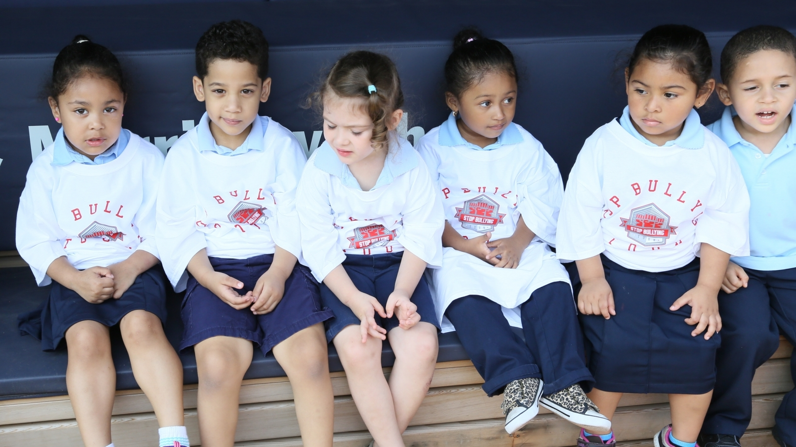

---
# You don't need to edit this file, it's empty on purpose.
# Edit theme's home layout instead if you wanna make some changes
# See: https://jekyllrb.com/docs/themes/#overriding-theme-defaults
layout: homepage
title: Stop Bullying Tour
description: "Description for the website."
---

<!-- HOME -->
<section class="bg-img-1">
	

		

			

				

				
				<h1>Stop Bullying Tour</h1>
				<h3>Taking the Solution on the Road</h3>
				

					<h3 class="text-center"><a href="http://donate.com" class="topbar" target="_blank">DONATE</a></h3>
				

				

			

		

	

</section>

<section>
	

		

			

				<h2>The Facts</h2>
				<ul class="statistics">
				  <li class="style1">
				    
				    <strong>3.2M</strong> students a Year get bullied
				  </li>
				  <li class="style3">
				    
				    <strong>160K</strong> teens skip school every day
				  </li>
				  <li class="style6">
				    
				      Every
				      <strong>7 Minutes</strong> a child is bullied.
				  </li>
				  <li class="style4">
				    
				    <strong>71%</strong> of students report incidents of bullying
				  </li>
				  <li class="style5">
				    
				    <strong>1/10</strong> drop out of school because of repeated bullying
				  </li>
				</ul>
			

		

	

</section>

<section class="style6">
	

		

			

				<h2>Our Efforts</h2>
				<ul class="features">
					<li>
						
						<h3>SBT Hubs</h3>
						
The SBT Hub will have a presence in the local community school and we will engage students in activities such as essays contest, arts, plays and music to give them an outlet to express themselves.

					</li>
					<li>
						
						<h3>Bullying 101</h3>
						
Bullying 101 brings together the community with experts to educate them on all aspects of bullying including identifying the issues and situation that contribute to the birth of "The Bully".

					</li>
					<li>
						
						<h3>The Den</h3>
						
(Conflict and Resolutions Center) The Den is a conflict resolution program that brings resources to schools and the local community to help educate and gives tools and solutions to both the bully and the bullied.

					</li>
				</ul>
			

		

	

</section>

<!-- About Us -->
<section>
  

      

        

          <h2 class="title" data-wow-delay=".1s">Our Past Projects</h2>
        

      

  

    

		
		  {{ forloop.index0 | mod:3 }}
		  
		    

		  
		    <!-- don't forget those pesky 'alpha' and 'omega' tags if they're in there -->
		    

		    	
            	
<a href="{{ post.url }}">Trip to a Music Studio</a>

		    

		  
		    

		  
		
    

</section>
<!-- END About Us -->

